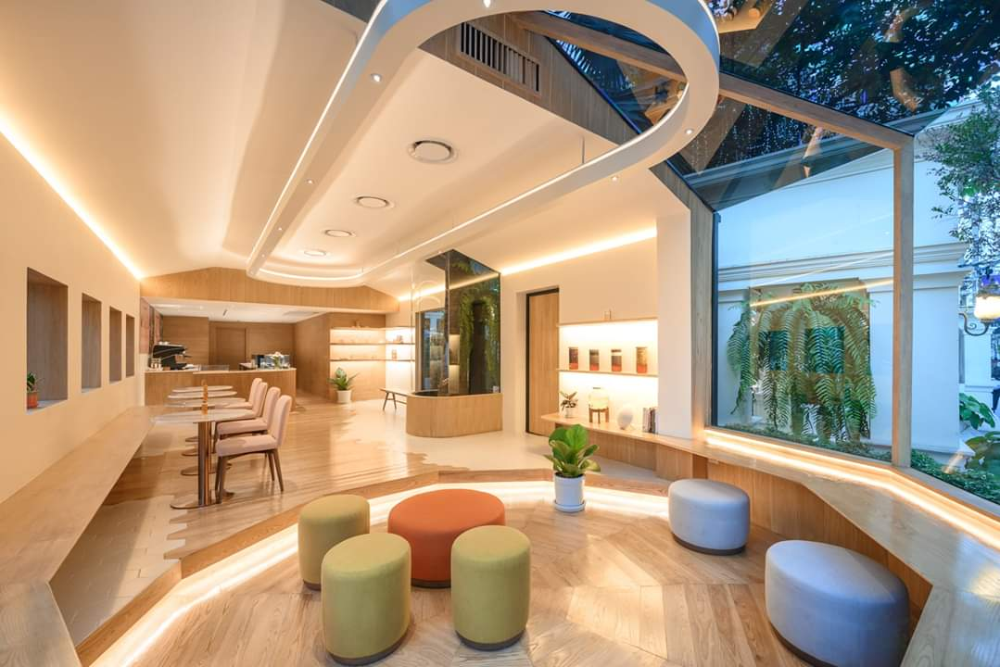

Honeyful Café is located at Yui's Ariston Sukhumvit 24
Hotel - Natthawan Supapong. She is a former Le Cordon Bleu student
chef who fell in love with honey. I decided to create this cafe to serve the
story of honey for people to know and enjoy eating honey as she felt.

In this project, I also had a chance to help with the branding, and
overlook the entire design and construction process. The concept of
Honeyful Café is like stepping into the world of bees with sweet honey
and various flavors and forms waiting to be discovered. Yui's original
idea was to have a greenhouse in front, so I designed the front
greenhouse to be a hexagonal honeycomb shape and put this shape in
other parts of the store, such as the logo, the pattern on the wood floor,
and to the ground level that digs into a hexagonal shape. The wooden
benches that stretch from the center of the store are designed to be
seamlessly functional and unified. When used from above it will be used
as a chair, but in the greenhouse area below, it will be used as a table to
make limited spaces look more spacious with furniture designs.

I wanted to brighten up this hexagon-concept store by putting soft lights to the
ceiling. It also makes the shop look wide and there is more space than you actually
can think of. Outside the shop, the same trees were preserved as part of the
building. Looking through the glass inside the shop, you can see a large palm tree
trunk inside a glass curved like a jar, therefore like being in a small hive under a big
tree with honey where you can immerse yourself in honey.
