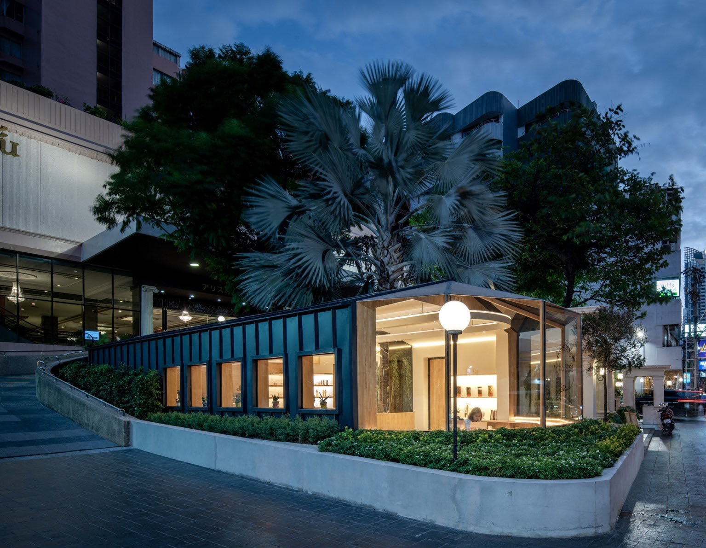

Honeyful Café คาเฟ่น้ำผึ้งที่ตั้งอยู่ที่โรงแรมอริสตัน สุขุมวิท 24 ของ ยุ้ย-
ณัฐวรรณ ศุภพงษ์ เธอเป็นเชฟศิษย์เลอ กอร์ดอง เบลอ อดีตนักเรียนวิศวะเคมี
และเป็นผู้ตกหลุมรักน้ำผึ้ง
จึงตั้งใจทำคาเฟ่นี้ขึ้นมาเพื่อเสิร์ฟเรื่องราวของน้ำผึ้งให้คนได้รู้จักและสนุกกันการ
กินน้ำผึ้งอย่างที่เธอรู้สึก

โปรเจคนี้เป็นโปรเจคนี้ผมมีโอกาสได้ช่วยตั้งแต่การออกแบบโลโก้
ออกแบบคอนเซ็ปต์ร้าน
รวมถึงเป็นสถาปนิกที่ดูแลทั้งการก่อสร้างและตกแต่งภายใน คอนเซ็ปต์ของ
Honeyful Café เหมือนการก้าวเข้ามาสู่โลกของผึ้ง ที่มีน้ำผึ้งหวานๆ
หลากหลายรสและหลายหลายรูปแบบรอให้เข้าไปสัมผัสข้างใน

ไอเดียแรกเริ่มของยุ้ยคืออยากให้มีเรือนกระจกด้านหน้า
ผมจึงออกแบบเรือนกระจกด้านหน้าให้เป็นรูปทรงหกเหลี่ยมของรังผึ้ง
และใส่รูปทรงนี้ไว้ในส่วนอื่นๆ ของร้าน เช่น โลโก้ ลวดลายบนพื้นไม้
ไปจนถึงพื้นต่างระดับที่ขุดลงไปเป็นรูปทรงหกเหลี่ยม
ม้านั่งไม้ที่ทอดยาวจากกลางร้านถูกออกแบบให้ใช้งานได้ต่างฟังก์ชันอย่างไร้รอย
ต่อและดูเป็นอันหนึ่งอันเดียวกัน
เมื่อใช้งานจากด้านบนจะเป็นจะถูกใช้งานเป็นเก้าอี้
แต่เมื่ออยู่ในเรือนกระจกด้านล่างจะถูกใช้งานเป็นโต๊ะ
ทำให้พื้นที่ที่มีอยู่อย่างจำกัดดูกว้างขวางมากขึ้นได้ด้วยการออกแบบเฟอร์นิเจอร์

บนฝ้าเพดานมีการทดลองยิงไฟขึ้นบนฝ้า
ทำให้ได้แสงที่ดูนุ่มนวลและที่ช่วยเพิ่มแสงสว่างให้กับร้านได้เทียบเท่ากับโคมดาว
น์ไลท์ ทำให้ร้านดูกว้าง และมีพื้นที่มากกว่าความเป็นจริงได้
ส่วนบริเวณนอกร้านยังคงเก็บรักษาต้นไม้ต้นเดิมเอาไว้ให้เป็นส่วนหนึ่งของตัวอาค
าร

เมื่อมองผ่านกระจกภายในร้านจะเห็นลำต้นของต้นปาล์มขนาดใหญ่อยู่ในโหลแก้
ว จึงเหมือนได้อยู่ในรังผึ้งเล็กๆ ใต้ต้นไม้ใหญ่ที่มีน้ำผึ้งให้ดื่มกินได้ตลอดทั้งวัน

_Architecture and Interior:_ Tune Kantharoup with Spacy Architecture
_Photography:_ Rungkit Charoenwat and Designsomething
