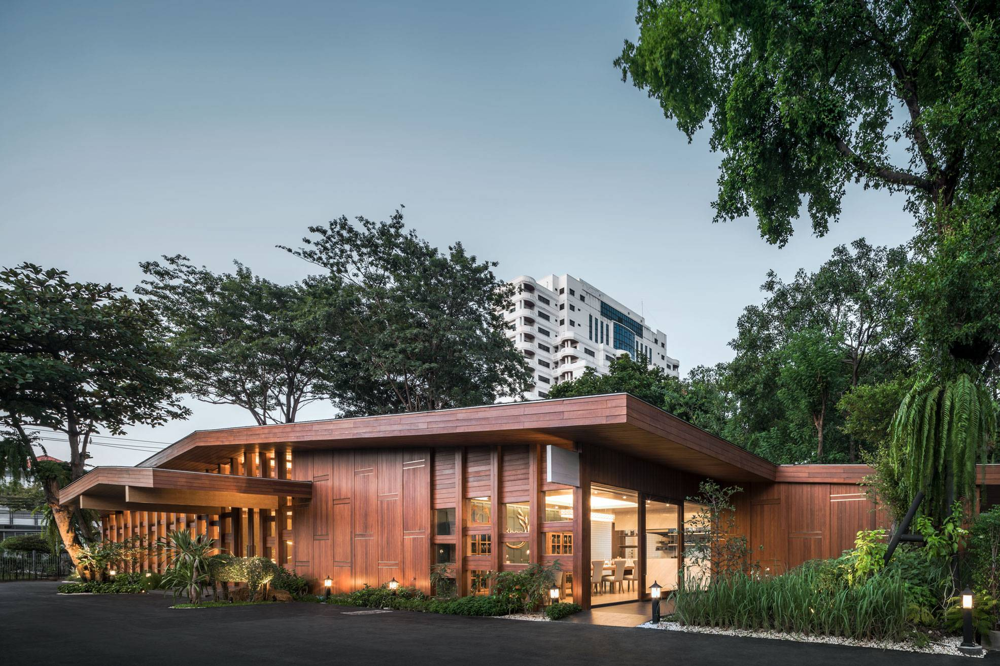

Khao is a Thai restaurant based on the concept of Chef Vichit Mukura, a
well-known Thai food chef who is known from the list of top Thai chefs
who always have tips and tricks for selecting ingredients. With over 40
years of experience working as an international Thai food chef, Chef
Vichit created Khao in Soi Sukhumvit 51, a Thai restaurant serving
Chef's Table only, before relocating Khao to Ekamai Soi 10. This branch
of Khao has changed the layout to have a more family-friendly food
menu and also Chef's Table menu.

Chef Vichit is a person who takes 'rice' very seriously, believes that good
rice will make that meal even more special. With a passion for selecting
raw materials and wanting to learn more about rice Chef Vichit then
experimented with farming. He grew organic rice to be used as a staple
in the store and to communicate rice to customers more deeply. The
design of Khao, Ekamai Soi 10 branch, puts details of Thai farming into
the design and allow customers to experience the Thai style that chefs
and I interpreted. Starting from the exterior structure, Chef Vichit wanted
recall a rice barn, an architecture that can be seen commonly in farming
areas throughout Thailand but is something that is difficult to find in the
city.

I applied the pattern of 'pakon', which is a popular wood decoration used in traditional Thai houses to design the building exterior and interior. And then I used clear glass between the wood to help increase the light in the restaurant to have more natural light to make the
restaurant look airy and comfortable, suitable for dining with family. The
round table used in the restaurant is a newly designed table to look like
a random fish trap. If you look outside the glass room on the side of the
restaurant, you will see a model farm planted by Chef Vichit for the
urban residents to closely experience the atmosphere of farming.

Besides being meticulous in the selection of raw materials Chef Vichit
also emphasizes cleanliness and order in the kitchen that he learned
from his mother since she was young. Usually, the Thai kitchen is not an
open kitchen. But with the uniqueness of the cleanliness and cleanliness
of the chef, the middle of the store is designed to be a kitchen that sees
every nook and cranny of the work. The back of the restaurant is a room
for the Chef's Table that requires reservations in advance. Inside the
room is an open kitchen where you can see the chef's cooking up close.
Looking out of the glass room, you will see a large tree that used to be in
the past. It is one of my intentions to keep as many large trees in the
same area as possible.

_Architecture and Interior:_ Tune Kantharoup with Spacy Architecture
_Photography:_ Rungkit Charoenwat and Wison Tungthunya
