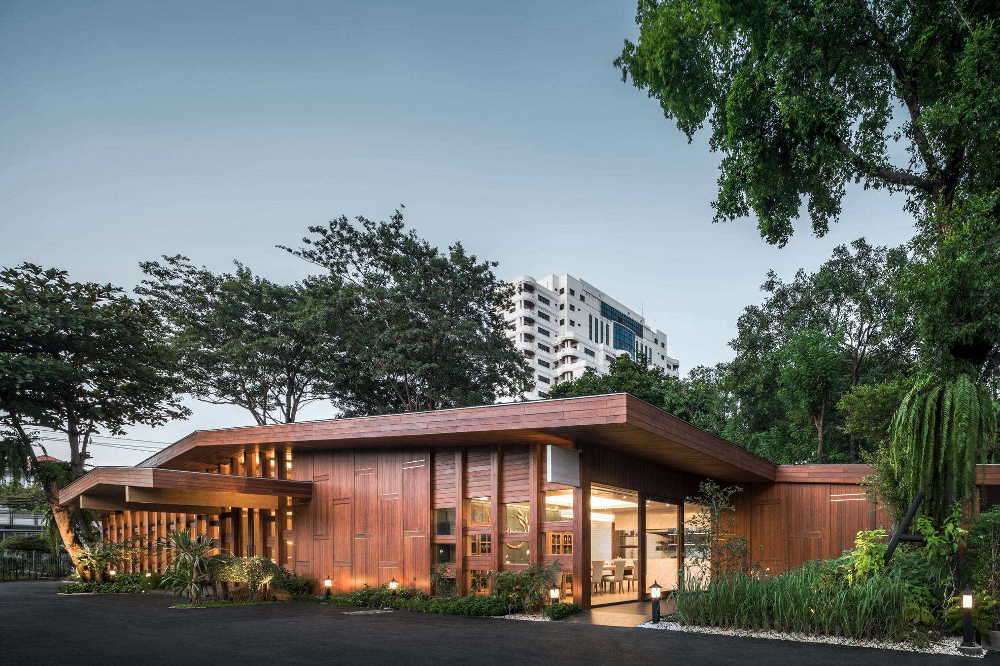
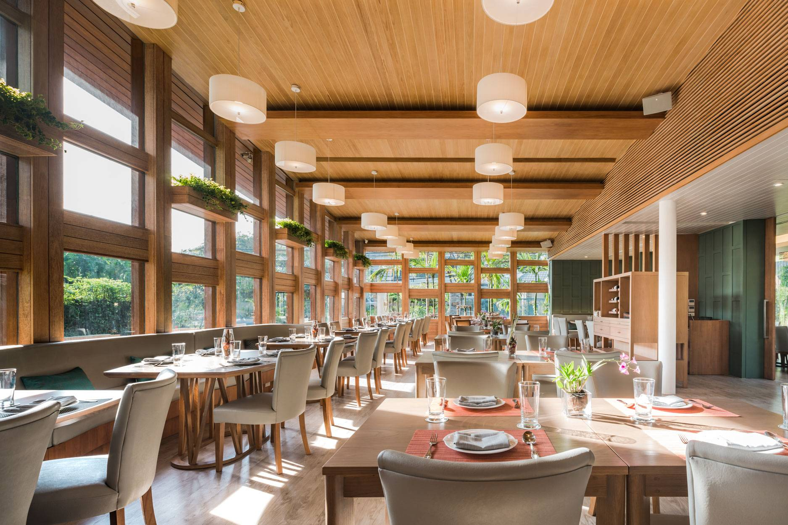
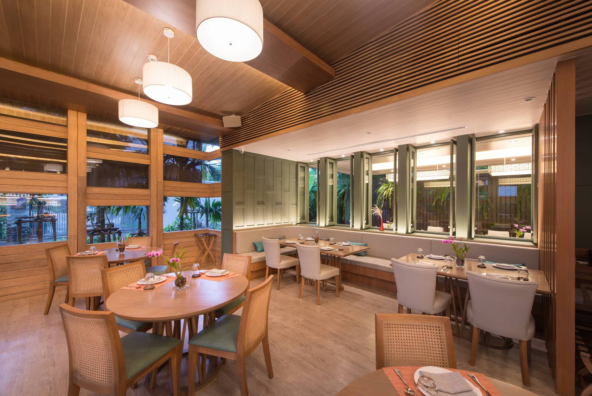

Khao (ข้าว) คือร้านอาหารไทยที่มาจากแนวคิดของ เชฟวิชิต
มุกุระ เชฟอาหารไทยชื่อดังที่เป็นที่รู้จักจากรายการ ยอดเชฟไทย
ที่มักจะมีคำแนะนำและเคล็ดลับในการคัดสรรวัตถุดิบต่างๆ
มาให้แฟนรายการติดตามผ่านหน้าจอโทรทัศน์อยู่เสมอ
จากประสบการณ์การทำงานเป็นเชฟอาหารไทยกว่า 40 ปี
ทำให้เชฟวิชิตคิดสร้างร้าน Khao ขึ้นมาที่ซอยสุขุมวิท 51
ซึ่งเป็นร้านอาหารไทยที่เสิร์ฟแบบ Chef’s Table เท่านั้น ก่อนจะย้ายร้าน Khao
มาอยู่ที่เอกมัย ซอย 10 ซึ่งเป็นร้านที่ผมได้ออกแบบขณะทำงานที่บริษัท Spacy
ร้าน Khao
สาขานี้ได้เปลี่ยนรูปแบบให้มีเมนูอาหารที่ครอบครัวมากินด้วยกันได้มากขึ้น
และยังคงมีการเสิร์ฟแบบ Chef’s Table ที่สาขานี้เช่นกัน

เชฟวิชิตเป็นคนที่ให้ความสำคัญกับ ‘ข้าว’ มาก
เพราะเชื่อว่าข้าวที่ดีจะช่วยให้อาหารมื้อนั้นเป็นมื้อที่พิเศษยิ่งขึ้น
ด้วยความหลงใหลในการคัดสรรวัตถุดิบอยากเรียนรู้เรื่องข้าวให้มากขึ้น
เชฟวิชิตจึงทดลองทำนา ปลูกข้าวออแกนิกด้วยตัวเอง
เพื่อนำมาใช้เป็นวัตถุดิบในร้านและสื่อสารเรื่องข้าวให้กับลูกค้าได้ลงลึกมากขึ้นให้
กับทั้งลูกค้าชาวไทยและชาวต่างชาติ การออกแบบร้าน Khao สาขาเอกมัย ซอย
10 จึงใส่รายละเอียดของการทำเกษตรกรรมไทยเข้าไปในการออกแบบ
เพื่อให้ลูกค้าได้สัมผัสกับความเป็นไทยที่เชฟและผมร่วมกันตีความออกมาใหม่
เริ่มตั้งแต่โครงสร้างร้านภายนอกที่เชฟวิชิตอยากให้มีรูปทรงเหมือนยุ้งฉางข้าว
ซึ่งเป็นสถาปัตยกรรมที่เห็นได้ทั่วไปในพื้นที่ทำนาทั่วประเทศไทย
แต่เป็นสิ่งที่หาดูได้ยากในเขตเมือง ผมนำแพทเทิร์นของ ‘ฝาปะกน’
ซึ่งเป็นลายไม้ที่นิยมใช้ในบ้านทรงไทยโบราณมาใช้กับการออกแบบตัวอาคารภา
ยนอกและการตกแต่งภายใน

และใช้กระจกใสคั่นระหว่างไม้เพื่อช่วยเพิ่มช่องแสงในร้านให้มีแสงธรรมชาติเข้า
ถึงได้มากขึ้น ทำให้ร้านดูโปร่ง โล่ง สบาย เหมาะกับการทานอาหารกับครอบครัว
ส่วนโต๊ะกลมที่ใช้ภายในร้านเป็นโต๊ะที่ออกแบบขึ้นใหม่ให้มีลักษะคล้ายกับสุ่มดักป
ลา
และหากมองออกไปนอกห้องกระจกบริเวณด้านข้างของร้านจะเห็นแปลงนาจำลอง
ที่เชฟวิชิตปลูกไว้เพื่อให้คนเมืองได้สัมผัสกับบรรยากาศการทำนาอย่างใกล้ชิด

นอกจากการพิถีพิถันในเรื่องคัดสรรวัตถุดิบ
เชฟวิชิตยังให้ความสำคัญกับเรื่องความสะอาดและความเป็นระเบียบในครัวที่เรีย
นรู้จากแม่มาตั้งแต่ยังเด็ก โดยปกติแล้วครัวไทยมักจะไม่ทำเป็นครัวเปิด
แต่ด้วยเอกลักษณ์ในเรื่องความเนี้ยบและความสะอาดของเชฟ
บริเวณกลางร้านถูกออกแบบให้เป็นครัวที่เห็นทุกซอกทุกมุมของการทำงาน
ส่วนด้านหลังของร้านจะเป็นห้องสำหรับ Chef’s Table
ที่ต้องจองคิวล่วงหน้าเท่านั้น
ภายในห้องเป็นครัวเปิดที่สามารถดูการทำอาหารของเชฟได้อย่างใกล้ชิด
มองออกไปนอกห้องกระจกจะเห็นต้นไม้ใหญ่ที่เคยอยู่มาแต่ตั้งเดิม
เป็นหนึ่งในความตั้งใจของผมที่อยากเก็บต้นไม้ใหญ่ในพื้นที่เดิมเอาไว้ให้ได้มากที่
สุด

_Architecture and Interior:_ Tune Kantharoup with Spacy Architecture
_Photography:_ Rungkit Charoenwat and Wison Tungthunya
