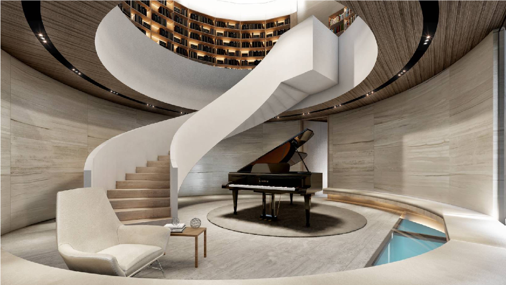

In this project, I am in charge of interior design and decoration, for an area of ​​approximately 700 square meters, and the custom made aspects and details that we love to create and design.

The owner of the house is interested in and enjoys Scandinavian style interiors that are both modern and minimalist. This matches some of my favorite interests and design work that I have long researched, visited, from Scandinavian houses dating back to 1930's and up to the present. It is one of the passions that influences my design inspiration. Another aspect which I am looking forward to completing is the homeowners' furniture, which is includes my aptitudes and interests as well - types of furniture in this house includes Fritz Hansen and Bo Concept from Denmark, Podium from Thai, and custom made furniture from some of the best carpenters in Thailand.
