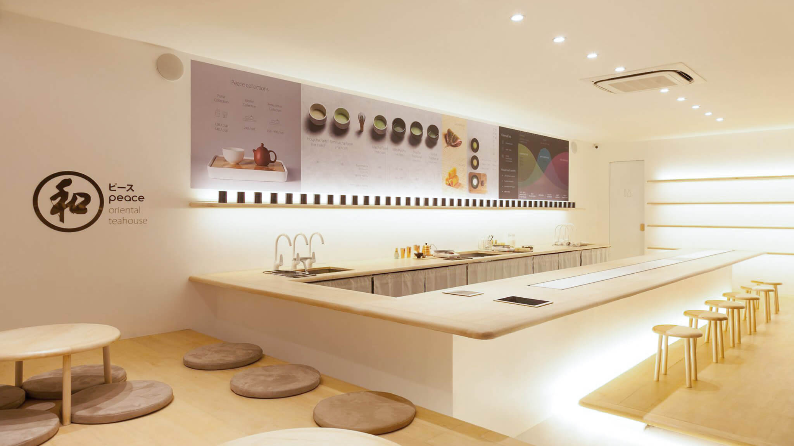
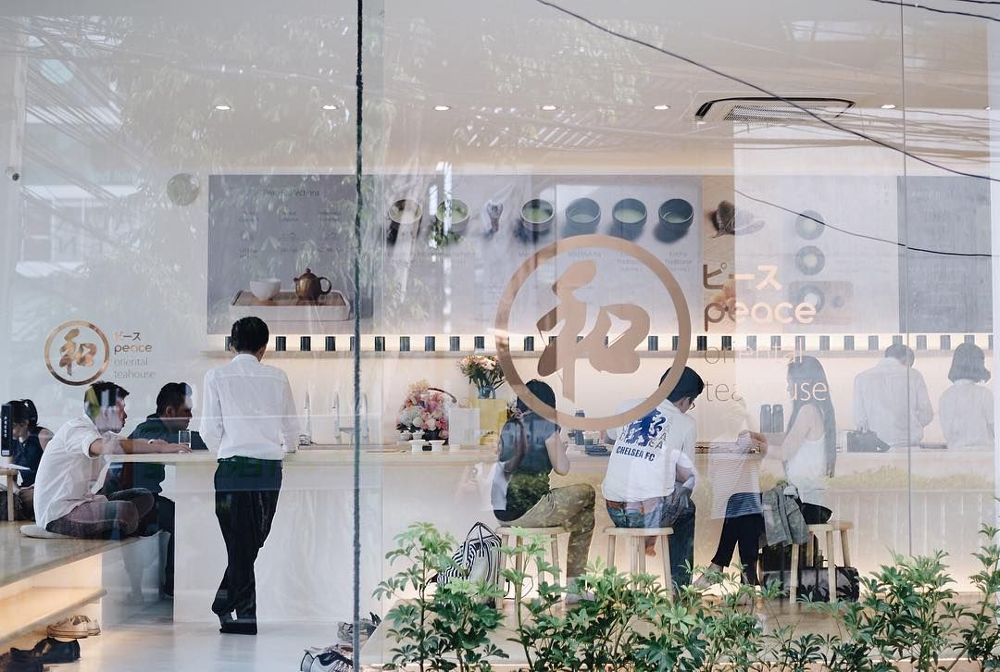

Peace - Oriental Teahouse, Sukhumvit 49 branch is the second home of
Khun Teerachai Limpaitoon, the shop owner saw that there were no tea
house in Thailand and wanted to bring the oriental tea culture and
spread it to Thai people.

Peace - Oriental Teahouse is an oriental tea shop that selects tea from
Japan and China. The shop is designed in a minimalist style but still retains the aura of eastern culture. Due to the limited space, there is
limited seats so customers can sit without feeling too cramped. The
interior design and decoration use beech wooden furniture with soft
tones. Ambient horizontal lighting accents creates a calm mood and 90
degree glass store gets abundant natural light. So no matter which
corner of the store you are seated, you will feel good and take good
photos because there is light from many directions.

In the middle of the restaurant is a bar counter that allows customers to
get closer to Tea Master, to see the tea making process, and to chat
closely. This bar counter has become the signature of the shop, which
has been applied to other branches as well. The front of the bar has
been re-invented to meet human scale. Besides the bar counter that
allows customers to see the tea making up close, customers can choose
to sit on the platform with small tables and cushions prepared. You can
also sit on the platform and lower your legs to look at the tea making at
the bar counter, or you can sit by the glass to look at the outside
atmosphere of Sukhumvit Soi 49 as well.
