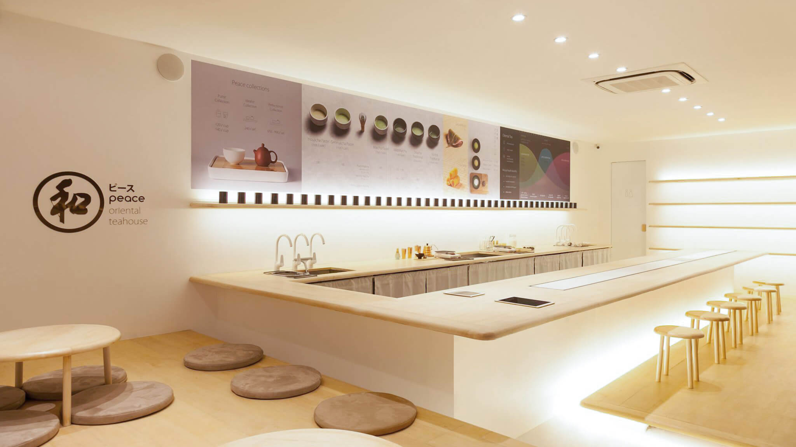
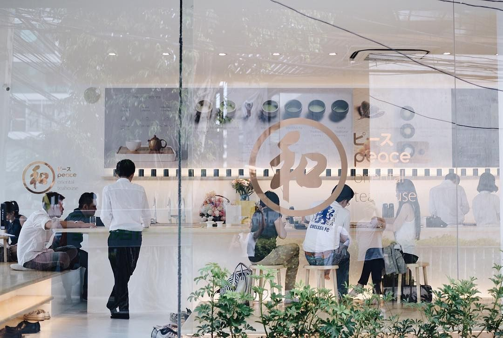

Peace - Oriental Teahouse สาขาสุขุมวิท 49 คือบ้านหลังที่ 2
ของคุณธีรชัย ลิมป์ไพฑูรย์ เจ้าของร้านที่เห็นว่าที่ไทยยังไม่มี Tea House
จึงอยากนำเอาวัฒนธรรมการดื่มชาแบบตะวันออกที่เขาหลงใหลมาเผยแพร่ให้คน
ไทยได้รู้จักและเข้าถึงได้ง่ายขึ้น

Peace - Oriental Teahouse
เป็นร้านชาแบบตะวันออกที่คัดสรรชามาจากญี่ปุ่นและจีน
ร้านจึงถูกออกแบบมาในสไตล์มินิมอล
แต่ยังคงรักษากลิ่นอายของวัฒนธรรมตะวันออกเอาไว้
ด้วยพื้นที่ที่มีจำกัดจึงต้องออกแบบให้ลูกค้าสามารถนั่งได้เยอะที่สุดโดยไม่รู้สึกอึดอั
ดและคับแคบจนเกินไป
การออกแบบและตกแต่งภายในจึงใช้เฟอร์นิเจอร์ไม้ที่มีสีโทนสว่าง
ใช้การติดตั้งไฟเป็นแนวยาวเพื่อให้เกิดเส้นนำสายตาที่ทำให้รู้สึกสงบ
และใช้กระจกรอบร้านเพื่อให้แสงธรรมชาติเข้าถึงมากที่สุด
ทำให้ไม่ว่าอยู่มุมไหนของร้านก็ทำให้ภาพถ่ายออกมาดูดีเพราะมีแสงเข้าจากหลา
ยทิศทาง

บริเวณตรงกลางร้านออกแบบเป็นเคาท์เตอร์บาร์ที่ทำให้ลูกค้าได้ใกล้ชิดกับ Tea
Master มากขึ้น ได้เห็นกระบวนการชงชาและพูดคุยกันอย่างใกล้ชิด
ซึ่งการทำเคาท์เตอร์บาร์ลักษะนี้ได้กลายมาเป็นเป็นซิกเนเจอร์ของร้านที่ถูกนำไปใ
ช้กับสาขาอื่นๆ ด้วยเช่นกัน
เพื่อความสบายในการนั่งดื่มชาของลูกค้าจึงได้มีการออกแบบเก้าอี้สำหรับนั่งดื่มที่
หน้าเคาท์เตอร์บาร์ขึ้นมาใหม่เพื่อให้สอดคล้องกับสรีระของทุกคน
ซึ่งเป็นเก้าอี้สเกลพิเศษที่เราตั้งใจออกแบบเพื่อให้เหมาะสำหรับสาขานี้เท่านั้น
นอกจากเคาท์เตอร์บาร์ที่ทำให้ลูกค้าได้เห็นการชงชาอย่างใกล้ชิด
ลูกค้าสามารถเลือกขึ้นมานั่งบนชั้นลอยที่มีโต๊ะเล็กและเบาะรองนั่งเตรียมไว้
จะนั่งชั้นลอยแล้วหย่อนขาหันมามาดูการชงชาที่เคาท์เตอร์บาร์ก็ได้
หรือจะนั่งริมกระจกมองบรรยากาศข้างนอกของซอยสุขุมวิท 49 ก็ได้เช่นกัน
