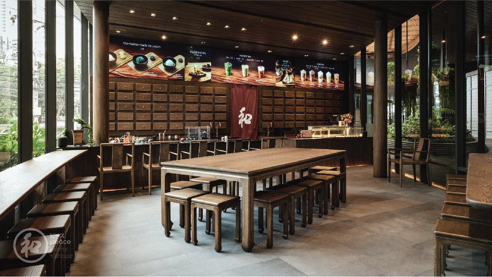

Peace Oriental Teahouse, Velaa Sindhorn Village branch, is the fifth branch that still maintains the design concept that brings out the charm of the East. Other branches focus on minimalism in Japanese style but only in this branch, the design emphasizes on reminiscing Chinese culture and details were designed to recreate this feeling. Each detail of the shop has been re-designed to suit the style of the Peace Oriental Teahouse.

When walking in, you will find an elevated floor, the same as the one at the Sukhumvit 49 branch, but the color and atmosphere are completely different from every branch. The floor pattern was inspired by the Siheyuan Courtyards, a traditional Chinese house design found in Beijing and Shanxi provinces. The traditional details were reduced to a more minimalist Chinese. Especially the details of the tables and chairs have been completely redesigned to match the traditional style of the shop. The atmosphere inside the store is like a simulation of Chinese herbal medicine in the countryside. The back wall is designed to look like a real herb drawer. The counter bar, which is another signature of the store, has been redesigned with new details to match the Chinese style and developed new functionality to make it best in aesthetics and function.
