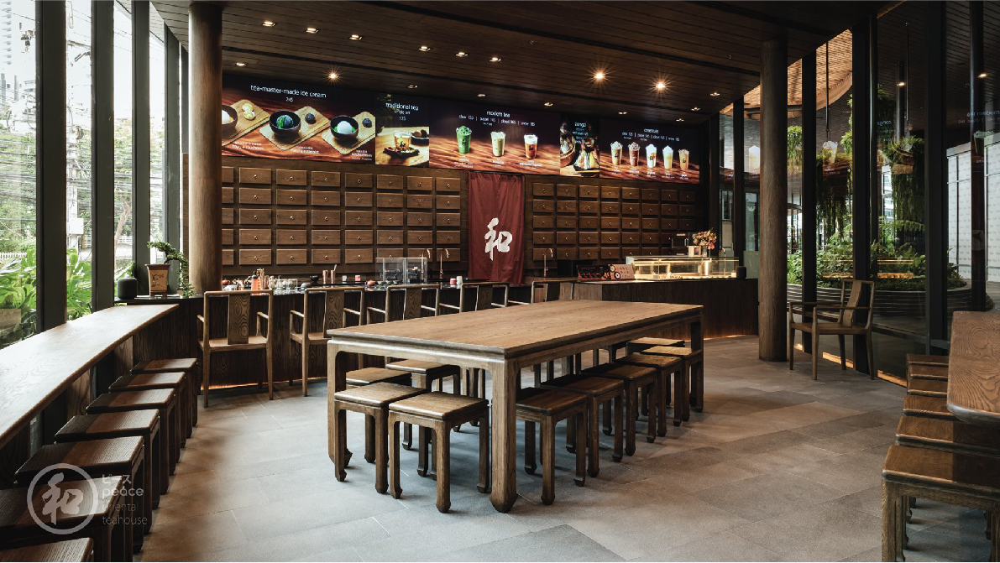

Peace Oriental Teahouse สาขา Velaa Sindhorn Village เป็นสาขาที่ 5
ที่ยังคงคอนเซ็ปต์การออกแบบที่นำเสนอเสน่ห์ของความเป็นตะวันออกเอาไว้ได้เป็
นอย่างดี สาขาอื่นจะเน้นความมินิมอลในสไตล์ญี่ปุ่น
แต่เฉพาะสาขานี้ที่เดียวที่จะเน้นกลิ่นอายความเป็นจีนอย่างชัดเจน
และเป็นจีนที่เข้าถึงง่ายและร่วมสมัยมากขึ้น
รายละเอียดในแต่ละส่วนของร้านจึงออกแบบขึ้นมาใหม่เพื่อให้เหมาะสมกับสไตล์
ของ Peace Oriental Teahouse

เมื่อเดินเข้ามาจะพบกับพื้นยกระดับ 1 ชั้น เหมือนกับร้านที่สาขาสุขุมวิท 49
แต่โทนสีและบรรยากาศต่างกันกับทุกสาขาโดยสิ้นเชิง
ลวดลายบนพื้นได้แรงบันดาลใจมาจากบ้านแบบซื่อเหอหยวน (Siheyuan
Courtyards) การออกแบบบ้านจีนโบราณที่พบได้ในมณฑลปักกิ่งและซานซี
มีการลดทอนรายละเอียดให้เป็นจีนที่ดูมินิมอลมากขึ้น
โดยเฉพาะดีเทลของโต๊ะเก้าอี้ที่ออกแบบขึ้นมาใหม่ทั้งหมดเพื่อให้เหมาะสมกับสไต
ล์ดั้งเดิมของร้าน

บรรยากาศภายในร้านเหมือนร้านเหมือนการจำลองยาสมุนไพรจีนในชนบทขึ้นม
า ผนังด้านหลังออกแบบให้เหมือนลิ้นชักใส่สมุนไพรจริงๆ
ส่วนเคาท์เตอร์บาร์ที่เป็นอีก Signature
หนึ่งของร้านได้ออกแบบดีเทลใหม่ให้เข้ากับความเป็นจีน
และพัฒนาฟังก์ชันการใช้งานใหม่ให้ดีขึ้นกว่าเดิม
