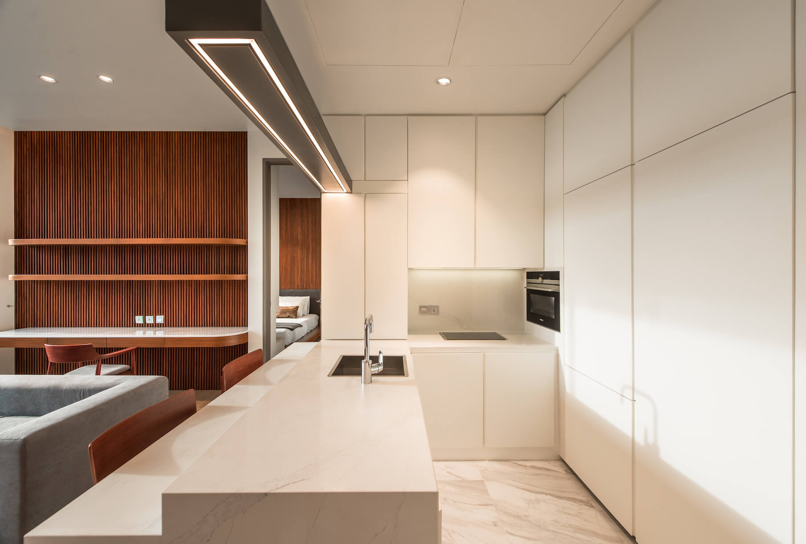

Kidd is one of Khao's customers that I have designed for. He became
my customer because he liked the design and interior work I did with
Khao, and forwarded to contact me to decorate the interior of his private
residence of Saladaeng One project.

Originally, this room was an empty room without interior design and
decoration so Kidd let me design and in the style that I am comfortable
with including giving the opportunity to experiment with something new
in the design of this room together. The area of ​​approximately 50 square
meters is designed to look wide and make the most of the space. From a
white wall, it has been transformed into a wooden wall with a vertical
pattern that gives the room more detail and weight. The plugs are hidden
in many places to make the whole room look more continuous. The built-
in kitchen is decorated in white and can be used as part of the counter
as a dining table to save space. I added a playful touch to various
furniture, floating from walls and shelves using a linear light. In addition,
all the furniture is redesigned and custom made to fit the space inside
the room to make this room with limited space look wider and be used
efficiently.
