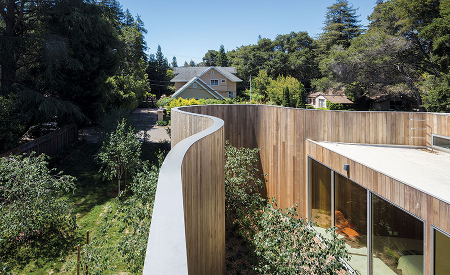
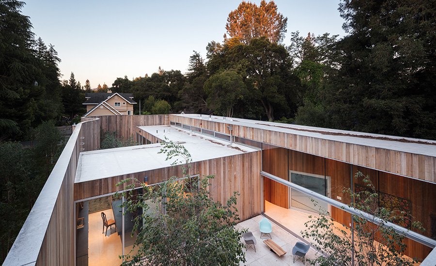
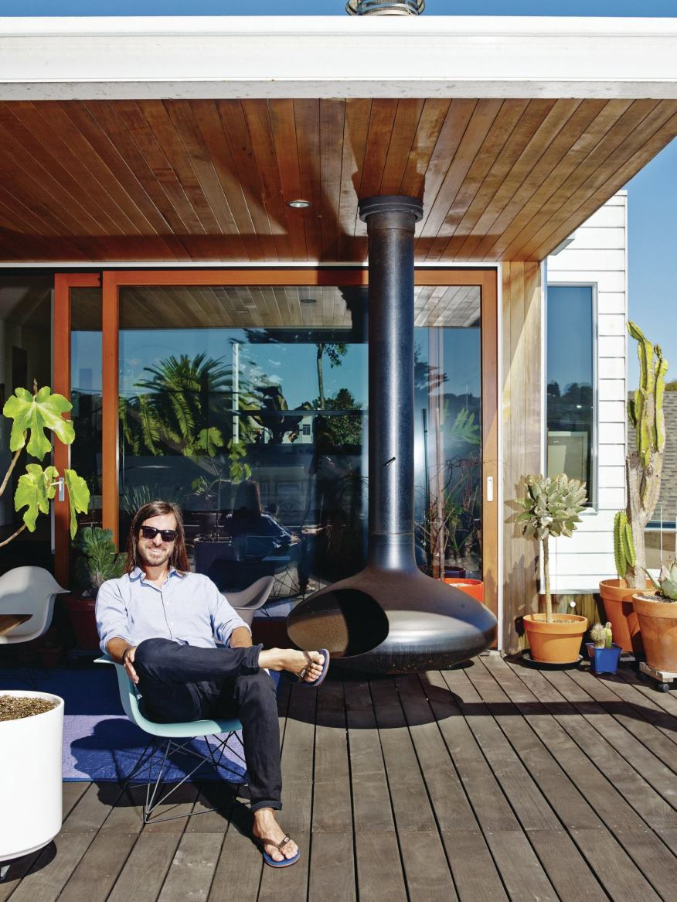

After finding work experience at an architect company in Japan. I came
back to work at an architect company in Thailand for a while and set out
for more experience in the United States.

Craig Steel Architecture is a San Francisco-based architect company
that I contacted for several months while in Thailand and finally got the
opportunity to come to the event. While working with Craig's team, the
Roofless House project, allowed me to learn how to build good
relationships with clients that help architects and homeowners work on
designing together – to meet the needs of customers in terms of both
function and lifestyle.

Roofless House is a house without a roof. It has a strange shape that
similar to a bean. The house is located on the outskirts of Silicon Valley.
It is a large detached house located in a wide open area surrounded by
big trees. The homeowners' challenge is the one-story house that feels
most like being outdoors as possible. The shape of the Roofless House
is inspired by a sculpture by British artist Henry Moore, whose work is to
design abstract art in the area. Because the homeowners are creative
people, they love the idea of ​​this unusual house shape.

California has a Mediterranean climate. In the summer, the climate is
very hot and dry. In winter, it is warm and rainy. Living space in the
house, therefore, focuses on open space to make the house look wide
and light. Sliding glass doors creates limitless view between inside and
out. Materials and contoured shapes provide a smooth, continuous feel.
Whether in or outside the house, it feels the same. Inside the house
there is a courtyard that allows natural light to reach multiple directions.
The rounded shape of the wooden house creates a natural pattern when
sunlight hits the birch trees and walls. Looking up, you can see the trees
and the sky as if under natural shade, according to the concept of a
roofless house which was the initial idea.

_Architecture and Interior:_ Tune Kantharoup with Craig Steely
_Photography:_ Darren Bradley
